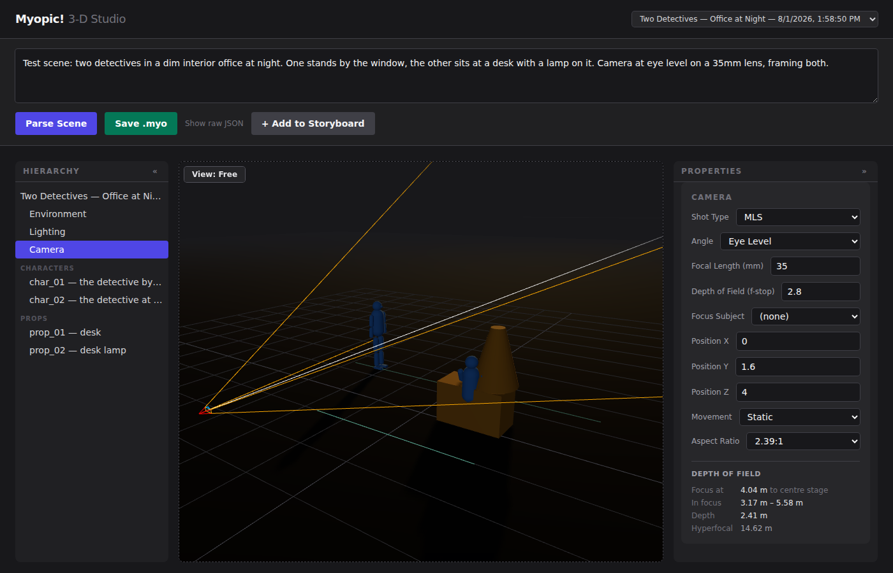

# Myopic! 3-D Studio

A prompt-driven 3D storyboarding tool. Describe a scene in plain English, and it comes
back as blocking you can walk around: figures on a floor, a camera with a real lens, light
coming from somewhere specific.



## What it's for

It answers **blocking** questions — where is everyone standing, what does a 35mm see from
here, which way do the shadows fall, how much of this holds focus. It is not a rendering
tool, and it is deliberately not trying to become one: every object is proxy geometry, and
the picture is meant to be *readable*, not finished.

That boundary is a governed decision rather than a matter of taste. Shadows, a horizon,
atmospheric haze, and a depth-of-field readout are in, because a director makes decisions
from them. Ray tracing, texture maps, reflections, and rendered lens blur are out. See
[`PRD.md` §11](PRD.md) for the test and the amendment log.

## Quick start

You need **Node 22** — that is what CI pins and what this is verified against — and an
**Anthropic API key** if you want to parse new prompts.

```bash
git clone https://github.com/saintgrego/myopic-studio
cd myopic-studio/myopic-studio        # the app lives one level down

npm ci

cp .env.example .env                  # then put your real key in it
npm run dev                           # backend :4000 + frontend :3000
```

Open **http://localhost:3000**.

Two notes that will save you a confused ten minutes:

- **The six saved scenes load without an API key.** Everything below except step 8 works
  with no key at all — the key is only needed to parse *new* prompts.
- **The key is server-side only.** It lives in `myopic-studio/.env` and is read by the
  Express backend. Never give it a `REACT_APP_` prefix; that would bundle it into the
  browser.

## The first five minutes

A tour that shows what the tool is actually for, using scenes already in the repo.

1. **Load a scene.** Top-right dropdown → *Two Detectives — Office at Night*. Two figures,
   a desk, a practical lamp.
2. **Click `Camera`** in the left-hand hierarchy. The right panel is now the camera.
3. **Change *Depth of Field* from 2.8 to 8.** Watch the focus readout at the bottom of the
   panel widen — and the two teal lines on the floor spread apart with it. Those are the
   near and far limits of focus, drawn where they cross the shot. That is the difference
   between "both detectives are sharp" and "only one is."
4. **Change *Focal Length* from 35 to 85.** The framing tightens for real — focal length
   drives the camera's field of view off a 36mm full-frame sensor, so a 35mm and an 85mm
   genuinely differ.
5. **Click *View: Free*** (top-left of the viewport) to switch to *View: Camera*. Now you
   see the letterboxed shot at its true aspect ratio, rather than the orbiting overview.
6. **Set *Focus Subject* to `char_01`.** The camera swings to aim at the detective by the
   window instead of centre stage.
7. **Load *Distant Figure at Sunset*.** Its subject sits past the hyperfocal distance, so
   the readout says `3.82 m – ∞` and only the near marker draws — "everything from here
   back is sharp," stated as a fact.
8. **Type your own prompt** in the box at the top and hit *Parse Scene* (needs the API
   key). Anything the model is unsure about comes back marked `[?]` and flagged for review
   rather than silently guessed.

Then **Save .myo** to write it to `scenes/`, or **+ Add to Storyboard** to pin the shot to
the strip along the bottom.

## How it works

Two processes. A Create React App frontend on `:3000` and a small Express backend on
`:4000`; CRA proxies `/api/*` across, so there is no CORS setup.

The backend exists for two reasons: the Anthropic key must never reach the browser, and
`.myo` files need real filesystem access.

```
prompt ──▶ POST /api/parse ──▶ claude-sonnet-5 ──▶ scene graph
                                                      │
                                              Zustand sceneStore
                                                      │
                        ┌─────────────────────────────┼──────────────────────┐
                        ▼                             ▼                      ▼
                   Viewport.tsx              PropertiesPanel          POST /api/scenes
                  (all the Three.js)        (every edit via            └▶ scenes/<uuid>.myo
                                              setField)
```

Scenes are plain JSON on disk in `myopic-studio/scenes/`. The storyboard is
`storyboard.json`. Both are yours — edit them through the app rather than by hand, and note
that **storyboard changes save immediately**, with no dirty/save gate.

## Commands

All from `myopic-studio/`.

| command | what it does |
| --- | --- |
| `npm run dev` | backend + frontend together — the normal way to run |
| `npm start` | frontend only, hot reloads |
| `npm run server` | backend only (plain node — **no** hot reload) |
| `npx tsc --noEmit` | typecheck |
| `npm run test:ci` | unit tests, single run |
| `npm run build` | production build (also runs ESLint) |
| `node scripts/generate-pose-glbs.mjs` | regenerate the pose `.glb` library |

The last three are the gates CI enforces on every pull request.

## Gotchas

- **Restart the backend after editing `server/*.js`.** It is a plain node process with no
  watcher. A newly added route returning 404 is almost always a stale backend.
- **The backend port variable is `MYOPIC_SERVER_PORT`, not `PORT`** — CRA's tooling owns
  `PORT`. The `PORT=4000` line in `.env.example` is dead and the server never reads it.
- **`CI=true npm run build` is stricter than a plain build**: it turns ESLint warnings into
  errors. That is what runs in CI, so check it before pushing.
- **`three` and `@types/three` are pinned at 0.160.0.** Later type definitions use syntax
  the pinned TypeScript 4.9.5 cannot parse.

## Where things are written down

- **[`PRD.md`](PRD.md)** — the authoritative spec. Closed decisions, non-goals, the mesh
  abstraction, and the §11 amendment log that governs what the renderer is allowed to do.
- **[`STATE.md`](STATE.md)** — the build log. Per-milestone evidence, and the hard-won
  details behind choices that look arbitrary until you know why.
- **[`CLAUDE.md`](CLAUDE.md)** — orientation for Claude Code working in this repo.
- **`myopic-3d-studio.md`** — the original v0.1 spec, superseded by `PRD.md` but still a
  useful component and parameter reference.
